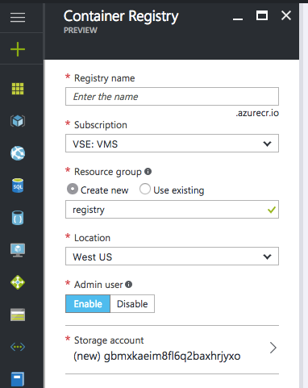

# dewarsztaty - Windows Containers

##Przygotowanie środowiska
	
1. Założenie konta Microsoft Account -[http://outlook.com](http://outlook.com)
2. Aktywacja konta Azure z AzurePass - [link](https://www.microsoftazurepass.com/)
3. Instalacja środowsika w Azure z szablonu. Klikamy na przycisk **Deploy to Azure** poniżej. Przy wypełnianiu parametrów wdrożenia w polu **Resource group** wybieramy **Create new** i wpisujemy **devwarsztaty** oraz jako **Location** ustawiamy **West Europe**

	<a href="https://portal.azure.com/#create/Microsoft.Template/uri/https%3A%2F%2Fraw.githubusercontent.com%2Fkaluzaaa%2Fdewarsztaty-Windows-Containers%2Fmaster%2Ftemplates%2Fazuredeploy.json" target="_blank">
    
</a>

##Instalacja Docker na Windows Server

**VM: Docker02**

Na serwerze instalujemy Windows Containers i silnik Docker

```powershell
Install-Module -Name DockerMsftProvider -Repository PSGallery -Force

Install-Package -Name docker -ProviderName DockerMsftProvider

Restart-Computer -Force
```

Sprawdzenie wersji zainstalowanego Docker

```
docker version
```

Uruchomienie testowego kontenera

```
docker run microsoft/dotnet-samples:dotnetapp-nanoserver
```

##Pierwszy kontener

```
docker run microsoft/windowsservercore hostname
```

```
docker  run microsoft/windowsservercore cmd
```

```
docker  run -it microsoft/windowsservercore cmd
```

##Uruchomienie kontenera z IIS
**VM: Docker02**

Na serwerze

```
docker run -d --name iis01 -p 80:80 microsoft/iis cmd
```

Sprawdź adres ip kontenera

```
docker inspect -f "{{ .NetworkSettings.Networks.nat.IPAddress }}" iis01
```

Sprawdź stronę na porcie 80 korzystając z wcześniej sprawdzonego IP

Podłącz się do kontenera

```
docker exec -it iis01 cmd
```

Skasuj iisstart.htm i utwórz nowy plik index.html

```
del C:\inetpub\wwwroot\iisstart.htm

echo "Hello World From a Windows Server Container" > C:\inetpub\wwwroot\index.html
```

Odśwież stronę

```
exit
```

Wyświetl kontenery

```
docker ps -a
```

Wyłącz kontener

```
docker stop iis01
```

##Tworzenie własnego obrazu ręcznie
**VM: Docker02**

Stworzenie obrazu z istniejącego kontenera

```
docker commit iis01 modified-iis
```

Wyświetlenie dostępnych obrazów

```
docker images
```

Stworzenie obrazu z przypisaniem taga

```
docker commit iis01 modified-iis:test
```

Wyświetlenie dostępnych obrazów

```
docker images
```

##Tworzenie własnego obrazu z Dockerfile
**VM: Docker02**

Uruchom Visual Studio Code i wciśnij Crtl+Shift+P i wpisz ext install, enter. Wyszukaj **docker support** i zainstaluj rozszerzenie.

Utwórz folder **C:\own-iis** i w nim plik **Dockerfile**

Zawartość pliku:

```
FROM microsoft/windowsservercore
CMD echo Hello World!
```

Polecenie wykonujemy będąc w katalogu **C:\own-iis**

```
docker build -t own-iis:1 .
```

```
docker run own-iis:1
```

Stwórz w katalogu **C:\own-iis** plik index.html z dowolną zawartością np.

```
<h1>devwarsztaty</h1>
```

```
FROM microsoft/windowsservercore
SHELL ["powershell"]
RUN Install-WindowsFeature -name Web-Server
RUN Install-WindowsFeature NET-Framework-45-ASPNET  
RUN Install-WindowsFeature Web-Asp-Net45
COPY index.html C:\\inetpub\\wwwroot
EXPOSE 80
CMD ["ping", "-t", "localhost"]
```

```
docker build -t own-iis:2 .
```

```
docker run -p 80:80 own-iis:2
```

```
docker run -d -p 80:80 own-iis:2
```

```
FROM microsoft/windowsservercore
SHELL ["powershell"]
RUN Install-WindowsFeature -name Web-Server
RUN Install-WindowsFeature NET-Framework-45-ASPNET  
RUN Install-WindowsFeature Web-Asp-Net45
COPY index.html C:\\inetpub\\wwwroot
ENV URL=https://raw.githubusercontent.com/kaluzaaa/dewarsztaty-Windows-Containers/master/README.md
ADD $URL C:\\inetpub\\wwwroot
EXPOSE 80
CMD ["ping", "-t", "localhost"]
```

```
docker build -t own-iis:3 .
```

```
docker run -p 80:80 own-iis:3 cmd
```

```
docker attach <id kontenera>
```

```
FROM microsoft/windowsservercore
ENV URL=https://raw.githubusercontent.com/kaluzaaa/dewarsztaty-Windows-Containers/master/README.md
SHELL ["powershell"]
RUN Install-WindowsFeature -name Web-Server; \
		Install-WindowsFeature NET-Framework-45-ASPNET; \  
		Install-WindowsFeature Web-Asp-Net45
COPY index.html C:\\inetpub\\wwwroot
ADD $URL C:\\inetpub\\wwwroot
EXPOSE 80
CMD ["ping", "-t", "localhost"]
```


```
docker build -t own-iis:4 .
```

```
docker run -d -p 80:80 own-iis:4
```

##Dockerfile i własna aplikacja

**VM: Docker01**

Zainstaluj na Docker na Docker01.

Utwórz nowy projekt w Visual Studio:

- Visual C# \ Web \ ASP .NET Web Application
- Wyłącz Application Insights
- Wersja .NET 4.5.2
- Authentication: No authentication
- Template: MVC

Zrób publikację do C:\dockerApp\webapp

W C:\dockerApp stwórz plik Dockerfile

```
FROM microsoft/aspnet
COPY webapp C:\\inetpub\\wwwroot
EXPOSE 80
```

```
docker build -t mvc_demo .
```

```
docker run -d mvc_demo
```

Sprawdź stronę :-)

##Persystencja danych - mapowanie folderów z hosta
**VM: Docker01**

```
docker run -d -v C:/dockerApp/webapp:C:/inetpub/wwwroot microsoft/aspnet
```

Sprawdź stronę

Skasuj zawartość C:\dockerApp\webapp i stwórz plik index.html z dowolną zawartością np.

```
<h1>devwarsztaty</h1>
```

Sprawdź stronę

##docker-compose
**VM: Docker01**

Instalacja docker-compose

```
Invoke-WebRequest https://dl.bintray.com/docker-compose/master/docker-compose-Windows-x86_64.exe -UseBasicParsing -OutFile $env:ProgramFiles\docker\docker-compose.exe
```

Sklonowanie dema na C:\


```
git clone https://github.com/kaluzaaa/MusicStore
```

Zbudowanie aplikacji

```
docker-compose -f .\docker-compose.windows.yml build
```

Uruchomienie aplikacji

```
docker-compose -f .\docker-compose.windows.yml up
```

##Hostname i NAT
**VM: Docker01**

Wyłącz Firewall w Windows (normalnie robi się reguły)

```
docker run -d -h <twoj_hostname> -v C:/dockerApp/webapp:C:/inetpub/wwwroot microsoft/aspnet
```

Sprawdź przez przeglądarkę używając *<twoj_hostname>*

```
docker run -d -p 83:80 -v C:/dockerApp/webapp:C:/inetpub/wwwroot microsoft/aspnet
```

Z maszyny **dokcer02** sprawdź przez przeglądarkę używając ip publicznego **docker01** i portu **83**

##Azure Container Registry

Tworzymy nowy prywatny rejestr w Azure w regionie **East US**

<a href="https://portal.azure.com/#create/Microsoft.ContainerRegistry" target="_blank">
    
</a>



**VM: Docker02**

Zalogowanie się do rejestru

```
docker login <URL rejestru z portalu, kończy się na .azurecr.io> -u <użytkownik> -p <hasło>
```

Wyszukanie id obrazu do wypchnięcia

```
docker images
```

Otagowanie obrazu

```
docker tag <id obrazu> <URL rejestru>/demo/own-iis:latest
```

Wypchnięcie do rejestru

```
docker push <URL rejestru>/demo/own-iis:latest
```

Skasowanie wypchniętego obrazu z lokalnego hosta

```
docker rmi -f <id obrazu>
```

Pobranie korzystając z rejestru

```
docker pull <URL rejestru>/demo/own-iis:latest
```

Uruchomianie kontenera korzystając z rejestru

```
docker run -d -p 80:80 <URL rejestru>/demo/own-iis:latest
```


##VSTS
**VM: Docker01**

Utwórz nowy projekt w Visual Studio:

- Visual C# \ Web \ ASP .NET Web Application
- Wyłącz Application Insights
- Wersja .NET 4.5.2
- Authentication: No authentication
- Template: MVC

Podłącz się do Team Services w Visual Studio

Utwórz z projektu WebApplication projekt w VSTS i zrób pierwszy commit.

Zainstaluj w VSTS - [Docker for VSTS](https://marketplace.visualstudio.com/items?itemName=ms-vscs-rm.docker)

Nowy build definition ASP.NET Build (PREVIEW)


